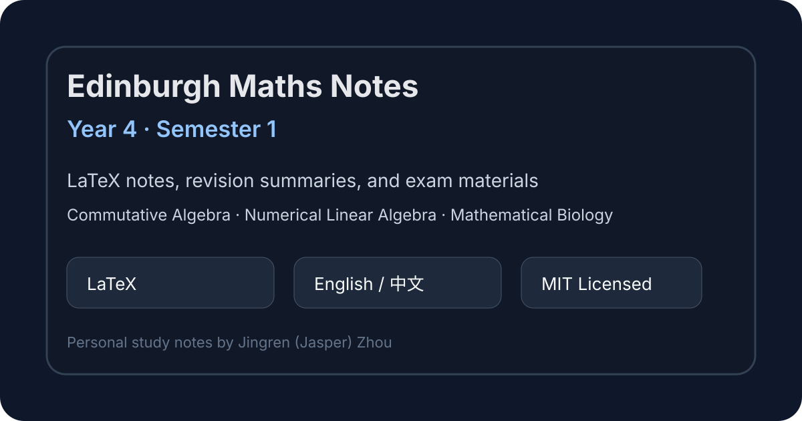

# Edinburgh Maths Year 4 Notes – Semester 1



A cleaned public collection of my personal **LaTeX notes, revision summaries, and selected exam materials** for **Year 4 Mathematics, Semester 1** at the **University of Edinburgh**.

This repository is intended as a polished archive of my own study materials. It is useful for reviewing course structures, comparing approaches to revision notes, and reusing LaTeX organisation patterns for mathematical note-taking.

## Courses included

| Course | Folder / material | Notes |
|---|---:|---|
| Commutative Algebra | `CA/Note/` | Ideals, rings, modules, localisation-style ideas, theorem summaries, and exam preparation |
| Numerical Linear Algebra | `NLA/Note/` | Matrix algorithms, numerical stability, iterative methods, and computational linear algebra revision |
| Mathematical Biology | `MB/Note/` | Model-based summaries, equations, biological systems, and revision material |
| Exam papers / final materials | `CA/`, `MB/`, `NLA/` PDFs where present | Selected final exam-style documents and polished outputs |

> Geometry was part of my Year 4 Semester 1 study plan, but this repository currently appears to focus mainly on CA, NLA, and MB materials.

## Repository structure

```text
.
├── CA/Note/        # Commutative Algebra notes
├── NLA/Note/       # Numerical Linear Algebra notes
├── MB/Note/        # Mathematical Biology notes
├── assets/         # README images and preview assets
├── note.cls        # Shared LaTeX class/style file if used by notes
├── note.tex        # Shared LaTeX template/source if used by notes
├── .gitignore      # LaTeX/editor build artefact exclusions
├── LICENSE         # MIT License
└── README.md
```

## Features

- Written in **LaTeX**
- Bilingual notes: **English and Chinese** where helpful
- Includes source notes and selected polished PDF outputs where present
- Focuses on definitions, theorem statements, computational methods, examples, and exam revision
- Cleaned for public release: LaTeX build artefacts, logs, and local editor files are excluded

## How to use

Read the compiled PDFs if present, or compile the `.tex` files yourself with XeLaTeX.

```bash
xelatex "Note File.tex"
```

For documents using references, tables of contents, or cross-references, run XeLaTeX more than once.

## Disclaimer

These are personal study notes and may contain mistakes, omissions, or non-standard explanations. They are **not official University of Edinburgh course materials**. Please use them as supplementary revision material only.

## License

Released under the [MIT License](LICENSE). You may use, adapt, and share the notes, but please keep the copyright and license notice.
